# 情商高手

> 课程：智能移动应用开发
>
> 操作系统：HarmonyOS NEXT

---

[TOC]

---

## 项目介绍

[情绪商数](https://zhida.zhihu.com/search?q=情绪商数&zhida_source=entity&is_preview=1)（Emotional Intelligence Quotient，简写成EQ），通常简称为情商，又称为“情绪智力” 、“[情绪智慧](https://zhida.zhihu.com/search?q=情绪智慧&zhida_source=entity&is_preview=1)”或“情绪智商”。

1995年，哈佛大学心理学博士丹尼尔·戈尔曼出版了《情商：为什么[情商比智商更重要](https://zhida.zhihu.com/search?q=情商比智商更重要&zhida_source=entity&is_preview=1)》一书，引起了全球性的EQ研究与讨论，因此，丹尼尔·戈尔曼被誉为“情商之父”。

对于“情商”的概念，[丹尼尔·戈尔曼](https://zhida.zhihu.com/search?q=丹尼尔·戈尔曼&zhida_source=entity&is_preview=1)并没有给出一个精确的定义。这个概念好像至今还没有非常完整确切的定义。就连那些经常把这句话挂在嘴边的心理学家也并没有对其下过确切定义。

情商是一种基本生存能力，它决定了一个人其他心智能力的表现，不懂得情商的人，其身心都是不健全！**在事业取得成功的过程中，80%靠得是情商，20%靠得是智商，良好的情商是获得职场成功的基本素质。**

**我们每天都在与人交流，处理各种人际关系问题，而拥有良好的情商是改善一个人际关系的重要条件。**当一个人面临工作压力、家庭变故、突发事件时，良好的情商是妥善处理一切的必备素质。当我们面对悲伤、失恋、离婚等诸多生活中的不如意时，更需要情商来调适我们自己的身心健康。提升情商使我们能够用有限的知识去运作无限的世界，更适合当前压力过大的生存环境。

**情商对于个人的人生成功、职场顺利和家庭幸福都是至关重要的。**根据戈尔曼教授的研究，童年、青少年时期的家庭环境和教育对于一个人情商的培养十分重要，奠定了一生幸福的基础。所以情商教育越早越好，要融入幼儿园、小学、中学的[教学过程](https://zhida.zhihu.com/search?q=教学过程&zhida_source=entity&is_preview=1)中，这就首先要求提升教师的情商，使他们在从事教育的同时也完成对人的教化。

（上面都是知乎抄的。。。）

由此我们“情商高手”应运而生，通过。。。。。。

（下面就是吹我们项目有多有用。。。解决生活难题、锻炼情商能力。。。）

---

## 功能模块

> <u>情商每日分享</u>和<u>AI高情商回复</u>是基本要求，这两块的基础实现甚至不需要用户个人账号，可以说是工作量很小；<u>情商测验</u>和<u>个人主页</u>是后续有时间可以继续补充，情商测验可以提高APP的趣味性，个人主页也是一个完善的APP不可或缺的一部分（赋予商业价值）。

### 情商每日分享（第一阶段）

- **功能介绍**：每日分享热门的考验情商的问题、提升情商小技巧、情商趣味故事
- **实现方式**：找资源每日定时发送即可
- **难点**：资源收集（爬虫）

### 情商论坛（暂时废除）

> 后来想了想这部分还是不做了。一是<u>实在老套</u>，写过好多次了；二是确实<u>工作量很多</u>，页面很多，想功能完善会很复杂。吧情商测验来替代这一部分，更有趣也更简单。

- **功能介绍**：用户分享考验情商的问题，其他用户可以在下面讨论回复（除了自由分享还应有一个主题分享）
- **实现方式**：论坛
- **难点**：规范发言（很难）

### AI高情商回复（第一阶段）

- **功能介绍**：对于用户难以解决的情商难题提供高情商解决方式
- **实现方式**：智普AI微调（寻找现有训练数据集、Python网络爬虫）
- **难点**：虽然实现起来没有技术难点，但是AI这个黑盒子最终效果如何难以确定（可以蒙混过关）

### 个人主页（第二阶段）

- **功能介绍**：用户个人信息（修改与显示）、评论记录、考试记录
- **实现方式**：normal
- **难点**：数据库设计

### 情商测验（第二阶段）

- **功能介绍**：用户进行情商测验
- **实现方式**：normal
- **难点**：资源收集（爬虫）

---

## UI设计

> [学习高情商话术平台 - 即时设计 (js.design)](https://js.design/f/yyXWz9?p=EpOj6yiU4k&mode=design)


---

## 具体实现

> Github仓库：[Redamancy-Xun/EQ_Master: 学习高情商话术平台](https://github.com/Redamancy-Xun/EQ_Master/tree/main)

### 测试

> [DevEco Testing | 华为开发者联盟](https://developer.huawei.com/consumer/cn/deveco-testing/)
>
> [DevEco Testing-专项测试-应用测试 - 华为HarmonyOS开发者](https://developer.huawei.com/consumer/cn/doc/harmonyos-guides-V5/devecotesting-V5)

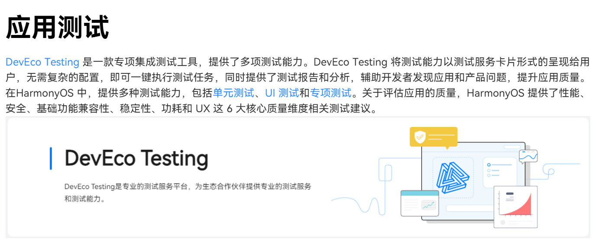

### 分发

> [应用市场接入-应用市场分发平台-应用上架-华为开发者联盟](https://developer.huawei.com/consumer/cn/appgallery/)

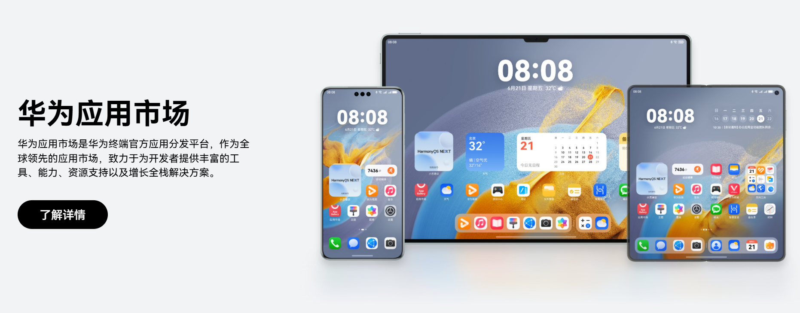

---

## 代码结构

> 本项目架构基于分层架构设计和模块化设计的理念。架构理论依据：[应用架构概述-架构-最佳实践 - 华为HarmonyOS开发者](https://developer.huawei.com/consumer/cn/doc/best-practices-V5/bpta-app-architecture-overview-V5)、[分层架构设计-架构-最佳实践 - 华为HarmonyOS开发者](https://developer.huawei.com/consumer/cn/doc/best-practices-V5/bpta-layered-architecture-design-V5)、[模块化设计-架构-最佳实践 - 华为HarmonyOS开发者](https://developer.huawei.com/consumer/cn/doc/best-practices-V5/bpta-modular-design-V5)
>
> 参考项目：[HMOSWorld: 基于分层架构和模块化设计的最佳实践，结合HarmonyOS"一次开发，多端部署"的能力，实现一款承载HarmonyOS最新技术特性，向HarmonyOS开发者赋能的示例应用。](https://gitee.com/harmonyos_samples/hmosworld)

### 应用程序包开发态包结构展示

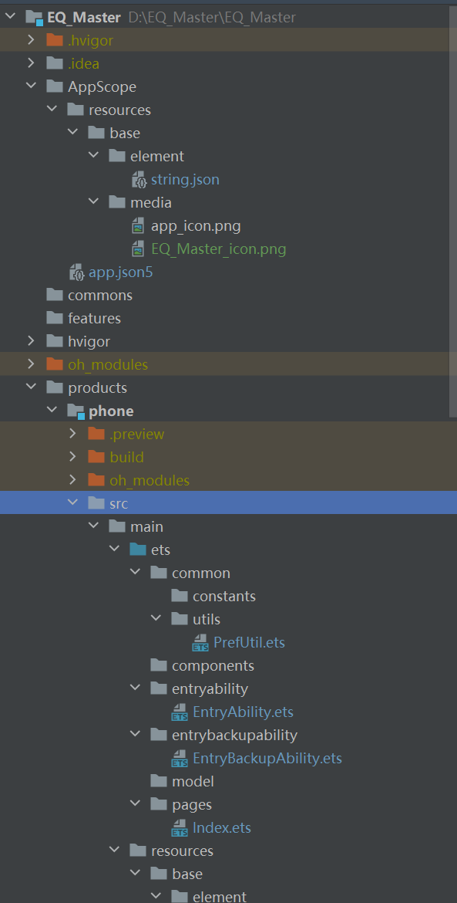

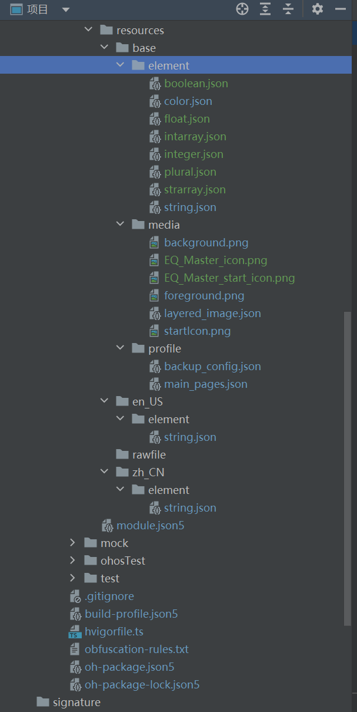

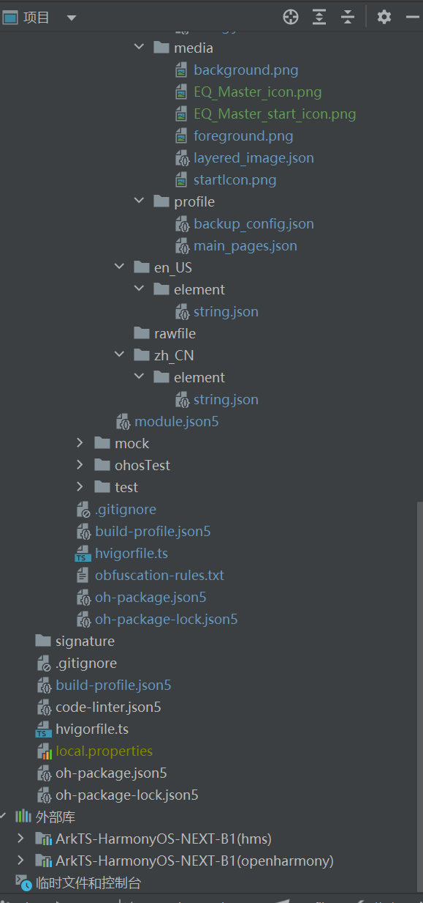

### 应用程序包开发态包结构说明

| 文件类型      | 说明                                                         |
| :------------ | :----------------------------------------------------------- |
| 配置文件      | 包括应用级配置信息、以及Module级配置信息 - **AppScope > app.json5**：[app.json5配置文件](https://developer.huawei.com/consumer/cn/doc/harmonyos-guides-V5/app-configuration-file-V5)，用于声明应用的全局配置信息，比如应用Bundle名称、应用名称、应用图标、应用版本号等。- **Module_name > src > main > module.json5**：[module.json5配置文件](https://developer.huawei.com/consumer/cn/doc/harmonyos-guides-V5/module-configuration-file-V5)，用于声明Module基本信息、支持的设备类型、所含的组件信息、运行所需申请的权限等。 |
| ArkTS源码文件 | **Module_name > src > main > ets**：用于存放Module的ArkTS源码文件（.ets文件）。 |
| 资源文件      | 包括应用级资源文件、以及Module级资源文件，支持图形、多媒体、字符串、布局文件等，详见[资源分类与访问](https://developer.huawei.com/consumer/cn/doc/harmonyos-guides-V5/resource-categories-and-access-V5)。- **AppScope > resources** ：用于存放应用需要用到的资源文件。- **Module_name > src > main > resources** ：用于存放该Module需要用到的资源文件。 |
| 其他配置文件  | 用于编译构建，包括构建配置文件、编译构建任务脚本、混淆规则文件、依赖的共享包信息等。- **build-profile.json5**：工程级或Module级的构建配置文件，包括应用签名、产品配置等。- **hvigorfile.ts**：应用级或Module级的编译构建任务脚本，开发者可以自定义编译构建工具版本、控制构建行为的配置参数。- **obfuscation-rules.txt**：混淆规则文件。混淆开启后，在使用Release模式进行编译时，会对代码进行编译、混淆及压缩处理，保护代码资产。- **oh-package.json5**：用于存放依赖库的信息，包括所依赖的三方库和共享包。 |

#### app.json5配置文件

app.json5配置文件包含以下标签。

| 属性名称                                                     | 含义                                                         | 数据类型 | 是否可缺省                                                   |
| :----------------------------------------------------------- | :----------------------------------------------------------- | :------- | :----------------------------------------------------------- |
| bundleName                                                   | 标识应用的Bundle名称，用于标识应用的唯一性。命名规则如下 ：- 由字母、数字、下划线和符号“.”组成，且必须以字母开头。- 字符串最小长度为7字节，最大长度128字节。- 推荐采用反域名形式命名（如“com.example.demo”，建议第一级为域名后缀com，第二级为厂商/个人名，第三级为应用名，也可以多级）。对于随系统源码编译的应用，建议命名为“com.ohos.demo”形式，其中的ohos标识系统应用。 | 字符串   | 该标签不可缺省。                                             |
| bundleType                                                   | 标识应用的Bundle类型，用于区分应用或者元服务。支持的取值如下：- app：当前Bundle为应用。- atomicService：当前Bundle为元服务。- shared：当前Bundle为共享库应用，预留字段。- appService：当前Bundle为系统级共享库应用，仅供系统应用使用。 | 字符串   | 该标签可缺省，缺省值为app。                                  |
| debug                                                        | 标识应用是否可调试。- true：可调试，一般用于开发阶段。- false：不可调试，一般用于发布阶段。 | 布尔值   | 由IDE编译构建时生成。该标签可缺省，缺省值为false。           |
| [icon](https://developer.huawei.com/consumer/cn/doc/harmonyos-guides-V5/app-configuration-file-V5#icon标签) | 标识[应用的图标](https://developer.huawei.com/consumer/cn/doc/harmonyos-guides-V5/application-component-configuration-stage-V5)，取值为图标资源文件的索引。 | 字符串   | 该标签不可缺省。                                             |
| label                                                        | 标识[应用的名称](https://developer.huawei.com/consumer/cn/doc/harmonyos-guides-V5/application-component-configuration-stage-V5)，取值为字符串资源的索引，字符串长度不超过63字节。 | 字符串   | 该标签不可缺省。                                             |
| description                                                  | 标识应用的描述信息。取值为长度不超过255字节的字符串，内容为描述信息的字符串资源索引。 | 字符串   | 该标签可缺省，缺省值为空。                                   |
| vendor                                                       | 标识对应用开发厂商的描述，取值为长度不超过255字节的字符串。  | 字符串   | 该标签可缺省，缺省值为空。                                   |
| versionCode                                                  | 标识应用的版本号，取值为小于2^31次方的正整数。此数字仅用于确定某个版本是否比另一个版本更新，数值越大表示版本越高。开发者可以将该值设置为任何正整数，但是必须确保应用的新版本都使用比旧版本更大的值。 | 数值     | 该标签不可缺省。                                             |
| versionName                                                  | 标识向用户展示的应用版本号。取值为长度不超过127字节的字符串，仅由数字和点构成，推荐采用“A.B.C.D”四段式的形式。四段式推荐的含义如下所示。第一段：主版本号/Major，范围0~99，重大修改的版本，如实现新的大功能或重大变化。第二段：次版本号/Minor，范围0~99，表示实现较突出的特点，如新功能添加或大问题修复。第三段：特性版本号/Feature，范围0~99，标识规划的新版本特性。第四段：修订版本号/Patch，范围0~999，表示维护版本，如修复bug。 | 字符串   | 该标签不可缺省。                                             |
| minCompatibleVersionCode                                     | 标识应用能够兼容的最低历史版本号，用于应用跨设备兼容性判断。取值范围为0~2147483647。 | 数值     | 该标签可缺省，缺省值等于versionCode标签值。                  |
| minAPIVersion                                                | 标识应用运行需要的SDK的API最小版本。取值范围为0~2147483647。 | 数值     | 应用编译构建时由build-profile.json5中的compatibleSdkVersion自动生成。 |
| targetAPIVersion                                             | 标识应用运行需要的API目标版本。取值范围为0~2147483647。      | 数值     | 应用编译构建时由build-profile.json5中的compileSdkVersion自动生成。 |
| apiReleaseType                                               | 标识应用运行需要的API目标版本的类型，采用字符串类型表示。取值为“CanaryN”、“BetaN”或者“Release”，其中，N代表大于零的整数。- Canary：受限发布的版本。- Beta：公开发布的Beta版本。- Release：公开发布的正式版本。 | 字符串   | 应用编译构建时根据当前使用的SDK的Stage自动生成。即便手动配置了取值，编译构建时也会被覆盖。 |
| accessible                                                   | 标识应用是否能访问应用的安装目录，仅针对Stage模型的系统应用和预置应用生效。 | 布尔值   | 该标签可缺省，缺省值为false。                                |
| multiProjects                                                | 标识当前工程是否支持多个工程的联合开发。- true：当前工程支持多个工程的联合开发。多工程开发可参考[多工程构建](https://developer.huawei.com/consumer/cn/doc/harmonyos-guides-V5/ide-hvigor-multi-projects-V5)。- false：当前工程不支持多个工程的联合开发。 | 布尔值   | 该标签可缺省，缺省值为false。                                |
| asanEnabled                                                  | 标识应用程序是否开启asan检测，用于辅助定位buffer越界造成的crash问题。- true：当前工程开启asan检测。- false：当前工程不开启asan检测。 | 布尔值   | 该标签可缺省，缺省值为false。                                |
| tablet                                                       | 标识对tablet设备做的特殊配置，可以配置的属性字段有上文提到的：minAPIVersion。如果使用该属性对tablet设备做了特殊配置，则应用在tablet设备中会采用此处配置的属性值，并忽略在app.json5公共区域配置的属性值。 | 对象     | 该标签可缺省，缺省时tablet设备使用app.json5公共区域配置的属性值。 |
| tv                                                           | 标识对tv设备做的特殊配置，可以配置的属性字段有上文提到的：minAPIVersion。如果使用该属性对tv设备做了特殊配置，则应用在tv设备中会采用此处配置的属性值，并忽略在app.json5公共区域配置的属性值。 | 对象     | 该标签可缺省，缺省时tv设备使用app.json5公共区域配置的属性值。 |
| wearable                                                     | 标识对wearable设备做的特殊配置，可以配置的属性字段有上文提到的：minAPIVersion。如果使用该属性对wearable设备做了特殊配置，则应用在wearable设备中会采用此处配置的属性值，并忽略在app.json5公共区域配置的属性值。 | 对象     | 该标签可缺省，缺省时wearable设备使用app.json5公共区域配置的属性值。 |
| car                                                          | 标识对car设备做的特殊配置，可以配置的属性字段有上文提到的：minAPIVersion。如果使用该属性对car设备做了特殊配置，则应用在car设备中会采用此处配置的属性值，并忽略在app.json5公共区域配置的属性值。 | 对象     | 该标签可缺省，缺省时car设备使用app.json5公共区域配置的属性值。 |
| default                                                      | 标识对default设备做的特殊配置，可以配置的属性字段有上文提到的：minAPIVersion。如果使用该属性对default设备做了特殊配置，则应用在default设备中会采用此处配置的属性值，并忽略在app.json5公共区域配置的属性值。 | 对象     | 该标签可缺省，缺省时default设备使用app.json5公共区域配置的属性值。 |
| targetBundleName                                             | 标识当前包所指定的目标应用, 标签值的取值规则和范围与bundleName标签一致。配置该字段的应用为具有overlay特征的应用。 | 字符串   | 该标签可缺省，缺省值为空。                                   |
| targetPriority                                               | 标识当前应用的优先级，取值范围为1~100。配置targetBundleName字段之后，才支持配置该字段。 | 数值     | 该标签可缺省, 缺省值为1。                                    |
| generateBuildHash                                            | 标识当前应用的所有HAP和HSP是否由打包工具生成哈希值。该字段配置为true时，该应用下的所有HAP和HSP都会由打包工具生成对应的哈希值。系统OTA升级时，若应用的versionCode保持不变，可根据哈希值判断应用是否需要升级。**说明：**该字段仅对预置应用生效。 | 布尔值   | 该标签可缺省, 缺省值为false。                                |
| GWPAsanEnabled                                               | 标识应用程序是否开启GWP-asan堆内存检测工具，用于对内存越界、内存释放后使用等内存破坏问题进行分析。- true：当前工程开启GWP-asan检测。- false：当前工程不开启GWP-asan检测。 | 布尔值   | 该标签可缺省, 缺省值为false。                                |
| [appEnvironments](https://developer.huawei.com/consumer/cn/doc/harmonyos-guides-V5/app-configuration-file-V5#appenvironments标签) | 标识当前模块配置的应用环境变量。                             | 对象数组 | 该标签可缺省，缺省值为空。                                   |
| maxChildProcess                                              | 标识当前应用自身可创建的子进程的最大个数，取值范围为0到512，0表示不限制，当应用有多个模块时，以entry模块的配置为准。 | 数值     | 该标签可缺省，缺省时使用系统配置的默认值。                   |
| [multiAppMode](https://developer.huawei.com/consumer/cn/doc/harmonyos-guides-V5/app-configuration-file-V5#multiappmode标签) | 标识当前应用配置的多开模式。仅bundleType为app的应用的entry或feature模块配置有效，存在多个模块时，以entry模块的配置为准。 | 对象     | 该标签可缺省，缺省值为空。                                   |
| cloudFileSyncEnabled                                         | 标识当前应用是否启用端云文件同步能力。- true：当前应用启用端云文件同步能力。- false：当前应用不启用端云文件同步能力。 | 布尔值   | 该标签可缺省，缺省值为false。                                |
| [configuration](https://developer.huawei.com/consumer/cn/doc/harmonyos-guides-V5/app-configuration-file-V5#configuration标签) | 标识当前应用字体大小跟随系统配置的能力。该标签是一个profile文件资源，用于指定描述应用字体大小跟随系统变更的配置文件。 | 字符串   | 该标签可缺省，缺省时configuration使用跟随系统默认设定。      |

#### module.json5配置文件

module.json5配置文件包含以下标签。

| 属性名称                                                     | 含义                                                         | 数据类型   | 是否可缺省                                |
| :----------------------------------------------------------- | :----------------------------------------------------------- | :--------- | :---------------------------------------- |
| name                                                         | 标识当前Module的名称，确保该名称在整个应用中唯一。命名规则如下 ：- 由字母、数字和下划线组成，且必须以字母开头。- 最大长度31字节。应用升级时允许修改该名称，但需要应用适配Module相关数据目录的迁移，详见[文件管理接口](https://developer.huawei.com/consumer/cn/doc/harmonyos-references-V5/js-apis-file-fs-V5#fscopydir10)。 | 字符串     | 该标签不可缺省。                          |
| type                                                         | 标识当前Module的类型。支持的取值如下：- entry：应用的主模块。- feature：应用的动态特性模块。- har：静态共享包模块。- shared：动态共享包模块。 | 字符串     | 该标签不可缺省。                          |
| srcEntry                                                     | 标识当前Module所对应的代码路径，取值为长度不超过127字节的字符串。 | 字符串     | 该标签可缺省，缺省值为空。                |
| description                                                  | 标识当前Module的描述信息，取值为长度不超过255字节的字符串，可以采用字符串资源索引格式。 | 字符串     | 该标签可缺省，缺省值为空。                |
| mainElement                                                  | 标识当前Module的入口UIAbility名称或者ExtensionAbility名称，取值为长度不超过255字节的字符串。 | 字符串     | 该标签可缺省，缺省值为空。                |
| [deviceTypes](https://developer.huawei.com/consumer/cn/doc/harmonyos-guides-V5/module-configuration-file-V5#devicetypes标签) | 标识当前Module可以运行在哪类设备上。**说明：**当存在多个模块时，各模块中的配置可以不一致，但必须包含所需的设备类型以确保正常运行。 | 字符串数组 | 该标签不可缺省。                          |
| deliveryWithInstall                                          | 标识当前Module是否在用户主动安装的时候安装，即该Module对应的HAP是否跟随应用一起安装。- true：主动安装时安装。- false：主动安装时不安装。 | 布尔值     | 该标签不可缺省。                          |
| installationFree                                             | 标识当前Module是否支持免安装特性。- true：表示支持免安装特性，且符合免安装约束。- false：表示不支持免安装特性。**说明：**当[bundleType](https://developer.huawei.com/consumer/cn/doc/harmonyos-guides-V5/app-configuration-file-V5#配置文件标签)为元服务时，该字段需要配置为true。反之，该字段需要配置为false。 | 布尔值     | 该标签不可缺省。                          |
| virtualMachine                                               | 标识当前Module运行的目标虚拟机类型，供云端分发使用，如应用市场和分发中心。如果目标虚拟机类型为ArkTS引擎，则其值为“ark+版本号”。 | 字符串     | 该标签由IDE构建HAP的时候自动插入。        |
| [pages](https://developer.huawei.com/consumer/cn/doc/harmonyos-guides-V5/module-configuration-file-V5#pages标签) | 标识当前Module的profile资源，用于列举每个页面信息，取值为长度不超过255字节的字符串。 | 字符串     | 在有UIAbility的场景下，该标签不可缺省。   |
| [metadata](https://developer.huawei.com/consumer/cn/doc/harmonyos-guides-V5/module-configuration-file-V5#metadata标签) | 标识当前Module的自定义元信息，可通过资源引用的方式配置[distributionFilter](https://developer.huawei.com/consumer/cn/doc/harmonyos-guides-V5/module-configuration-file-V5#distributionfilter标签)、[shortcuts](https://developer.huawei.com/consumer/cn/doc/harmonyos-guides-V5/module-configuration-file-V5#shortcuts标签)等信息。只对当前Module、UIAbility、ExtensionAbility生效。 | 对象数组   | 该标签可缺省，缺省值为空。                |
| [abilities](https://developer.huawei.com/consumer/cn/doc/harmonyos-guides-V5/module-configuration-file-V5#abilities标签) | 标识当前Module中UIAbility的配置信息，只对当前UIAbility生效。 | 对象数组   | 该标签可缺省，缺省值为空。                |
| [extensionAbilities](https://developer.huawei.com/consumer/cn/doc/harmonyos-guides-V5/module-configuration-file-V5#extensionabilities标签) | 标识当前Module中ExtensionAbility的配置信息，只对当前ExtensionAbility生效。 | 对象数组   | 该标签可缺省，缺省值为空。                |
| [definePermissions](https://developer.huawei.com/consumer/cn/doc/harmonyos-guides-V5/module-configuration-file-V5#definepermissions标签) | 标识系统资源hap定义的权限，不支持应用自定义权限。            | 对象数组   | 该标签可缺省，缺省值为空。                |
| [requestPermissions](https://developer.huawei.com/consumer/cn/doc/harmonyos-guides-V5/declare-permissions-V5#在配置文件中声明权限) | 标识当前应用运行时需向系统申请的权限集合。                   | 对象数组   | 该标签可缺省，缺省值为空。                |
| [testRunner](https://developer.huawei.com/consumer/cn/doc/harmonyos-guides-V5/module-configuration-file-V5#testrunner标签) | 标识用于测试当前Module的测试框架的配置。                     | 对象       | 该标签可缺省，缺省值为空。                |
| [atomicService](https://developer.huawei.com/consumer/cn/doc/harmonyos-guides-V5/module-configuration-file-V5#atomicservice标签) | 标识当前应用是元服务时，有关元服务的相关配置。               | 对象       | 该标签可缺省，缺省值为空。                |
| [dependencies](https://developer.huawei.com/consumer/cn/doc/harmonyos-guides-V5/module-configuration-file-V5#dependencies标签) | 标识当前模块运行时依赖的共享库列表。                         | 对象数组   | 该标签可缺省，缺省值为空。                |
| targetModuleName                                             | 标识当前包所指定的目标module，确保该名称在整个应用中唯一。取值为长度不超过31字节的字符串，不支持中文。配置该字段的Module具有overlay特性。仅在动态共享包（HSP）中适用。 | 字符串     | 该标签可缺省，缺省值为空。                |
| targetPriority                                               | 标识当前Module的优先级，取值范围为1~100。配置targetModuleName字段之后，才需要配置该字段。仅在动态共享包（HSP）中适用。 | 整型数值   | 该标签可缺省，缺省值为1。                 |
| [proxyData](https://developer.huawei.com/consumer/cn/doc/harmonyos-guides-V5/module-configuration-file-V5#proxydata标签) | 标识当前Module提供的数据代理列表。                           | 对象数组   | 该标签可缺省，缺省值为空。                |
| isolationMode                                                | 标识当前Module的多进程配置项。支持的取值如下：- nonisolationFirst：优先在非独立进程中运行。- isolationFirst：优先在独立进程中运行。- isolationOnly：只在独立进程中运行。- nonisolationOnly：只在非独立进程中运行。 | 字符串     | 该标签可缺省，缺省值为nonisolationFirst。 |
| generateBuildHash                                            | 标识当前HAP/HSP是否由打包工具生成哈希值。当配置为true时，如果系统OTA升级时应用versionCode保持不变，可根据哈希值判断应用是否需要升级。该字段仅在[app.json5文件](https://developer.huawei.com/consumer/cn/doc/harmonyos-guides-V5/app-configuration-file-V5)中的generateBuildHash字段为false时使能。**说明：**该字段仅对预置应用生效。 | 布尔值     | 该标签可缺省，缺省值为false。             |
| compressNativeLibs                                           | 标识libs库是否以压缩存储的方式打包到HAP。- true：libs库以压缩方式存储。- false：libs库以不压缩方式存储。 | 布尔值     | 该标签可缺省，缺省值为false。             |
| libIsolation                                                 | 用于区分同应用不同HAP下的.so文件，以防止.so冲突。- true：当前HAP的.so文件会储存在libs目录中以Module名命名的路径下。- false：当前HAP的.so文件会直接储存在libs目录中。 | 布尔值     | 该标签可缺省，缺省值为false。             |
| fileContextMenu                                              | 标识当前HAP的右键菜单配置项。取值为长度不超过255字节的字符串。 | 字符串     | 该标签可缺省，缺省值为空。                |
| querySchemes                                                 | 标识允许当前应用进行跳转查询的URL schemes，只允许entry类型模块配置，最多50个，每个字符串取值不超过128字节。 | 字符串数组 | 该标签可缺省，缺省值为空。                |
| [routerMap](https://developer.huawei.com/consumer/cn/doc/harmonyos-guides-V5/module-configuration-file-V5#routermap标签) | 标识当前模块配置的路由表路径。取值为长度不超过255字节的字符串。 | 字符串     | 该标签可缺省，缺省值为空。                |
| [appEnvironments](https://developer.huawei.com/consumer/cn/doc/harmonyos-guides-V5/module-configuration-file-V5#appenvironments标签) | 标识当前模块配置的应用环境变量，只允许entry和feature模块配置。 | 对象数组   | 该标签可缺省，缺省值为空。                |
| appStartup                                                   | 标识当前Module启动框架配置路径，仅在Entry中生效。            | 字符串     | 该标签可缺省，缺省值为空。                |
| [hnpPackages](https://developer.huawei.com/consumer/cn/doc/harmonyos-guides-V5/module-configuration-file-V5#hnppackages标签) | 标识当前应用包含的Native软件包信息。只允许entry类型模块配置。 | 对象数组   |                                           |

##### abilities标签说明

| 属性名称                                                     | 含义                                                         | 数据类型                      | 是否可缺省                                                  |
| :----------------------------------------------------------- | :----------------------------------------------------------- | :---------------------------- | :---------------------------------------------------------- |
| name                                                         | 标识当前UIAbility组件的名称，确保该名称在整个应用中唯一。取值为长度不超过127字节的字符串，不支持中文。 | 字符串                        | 该标签不可缺省。                                            |
| srcEntry                                                     | 标识入口UIAbility的代码路径，取值为长度不超过127字节的字符串。 | 字符串                        | 该标签不可缺省。                                            |
| [launchType](https://developer.huawei.com/consumer/cn/doc/harmonyos-guides-V5/uiability-launch-type-V5) | 标识当前UIAbility组件的启动模式，支持的取值如下：- multiton：多实例模式，每次启动创建一个新实例。- singleton：单实例模式，仅第一次启动创建新实例。- specified：指定实例模式，运行时由开发者决定是否创建新实例。- standard：multiton的曾用名，效果与多实例模式一致。 | 字符串                        | 该标签可缺省，该标签缺省为“singleton”。                     |
| description                                                  | 标识当前UIAbility组件的描述信息，取值为长度不超过255字节的字符串。要求采用描述信息的资源索引，以支持多语言。 | 字符串                        | 该标签可缺省，缺省值为空。                                  |
| icon                                                         | 标识当前UIAbility组件的图标，取值为图标资源文件的索引。      | 字符串                        | 该标签可缺省，缺省值为空。                                  |
| label                                                        | 标识当前UIAbility组件对用户显示的名称，要求采用该名称的资源索引，以支持多语言。取值为长度不超过255字节的字符串。 | 字符串                        | 该标签可缺省，缺省值为空。                                  |
| permissions                                                  | 标识当前UIAbility组件自定义的权限信息。当其他应用访问该UIAbility时，需要申请相应的权限信息。一个数组元素为一个权限名称。通常采用反向域名格式（不超过255字节），取值为系统预定义的权限。 | 字符串数组                    | 该标签可缺省，缺省值为空。                                  |
| [metadata](https://developer.huawei.com/consumer/cn/doc/harmonyos-guides-V5/module-configuration-file-V5#metadata标签) | 标识当前UIAbility组件的元信息。                              | 对象数组                      | 该标签可缺省，缺省值为空。                                  |
| exported                                                     | 标识当前UIAbility组件是否可以被其他应用调用。- true：表示可以被其他应用调用。- false：表示不可以被其他应用调用，包括无法被aa工具命令拉起应用。 | 布尔值                        | 该标签可缺省，缺省值为false。                               |
| continuable                                                  | 标识当前UIAbility组件是否支持跨端迁移。- true：表示支持迁移。- false：表示不支持迁移。 | 布尔值                        | 该标签可缺省，缺省值为false。                               |
| [skills](https://developer.huawei.com/consumer/cn/doc/harmonyos-guides-V5/module-configuration-file-V5#skills标签) | 标识当前UIAbility组件或ExtensionAbility组件能够接收的[Want](https://developer.huawei.com/consumer/cn/doc/harmonyos-guides-V5/want-overview-V5)特征集，为数组格式。配置规则：- 对于Entry类型的HAP，应用可以配置多个具有入口能力的skills标签（即配置了ohos.want.action.home和entity.system.home）。- 对于Feature类型的HAP，只有应用可以配置具有入口能力的skills标签，服务不允许配置。 | 对象数组                      | 该标签可缺省，缺省值为空。                                  |
| backgroundModes                                              | 标识当前UIAbility组件的长时任务集合，指定用于满足特定类型的长时任务。长时任务类型有如下：- dataTransfer：通过网络/对端设备进行数据下载、备份、分享、传输等。- audioPlayback：音频播放。- audioRecording：录音。- location：定位、导航。- bluetoothInteraction：蓝牙扫描、连接、传输（穿戴）。- multiDeviceConnection：多设备互联。- taskKeeping：计算。 | 字符串数组                    | 该标签可缺省，缺省值为空。                                  |
| startWindowIcon                                              | 标识当前UIAbility组件启动页面图标资源文件的索引，取值为长度不超过255字节的字符串。 | 字符串                        | 该标签不可缺省。                                            |
| startWindowBackground                                        | 标识当前UIAbility组件启动页面背景颜色资源文件的索引，取值为长度不超过255字节的字符串。取值示例：$color:red。 | 字符串                        | 该标签不可缺省。                                            |
| removeMissionAfterTerminate                                  | 标识当前UIAbility组件销毁后，是否从任务列表中移除任务。- true表示销毁后移除任务。- false表示销毁后不移除任务。 | 布尔值                        | 该标签可缺省，缺省值为false。                               |
| orientation                                                  | 标识当前UIAbility组件启动时的方向。支持的取值如下：- unspecified：未指定方向，由系统自动判断显示方向。- landscape：横屏。- portrait：竖屏。- follow_recent：跟随背景窗口的旋转模式。- landscape_inverted：反向横屏。- portrait_inverted：反向竖屏。- auto_rotation：随传感器旋转。- auto_rotation_landscape：传感器横屏旋转，包括横屏和反向横屏。- auto_rotation_portrait：传感器竖屏旋转，包括竖屏和反向竖屏。- auto_rotation_restricted：传感器开关打开，方向可随传感器旋转。- auto_rotation_landscape_restricted：传感器开关打开，方向可随传感器旋转为横屏， 包括横屏和反向横屏。- auto_rotation_portrait_restricted：传感器开关打开，方向随可传感器旋转为竖屏， 包括竖屏和反向竖屏。- locked：传感器开关关闭，方向锁定。- auto_rotation_unspecified：受开关控制和由系统判定的自动旋转模式。- follow_desktop：跟随桌面的旋转模式。 | 字符串                        | 该标签可缺省，缺省值为unspecified。                         |
| supportWindowMode                                            | 标识当前UIAbility组件所支持的窗口模式。支持的取值如下：- fullscreen：全屏模式。- split：分屏模式。- floating：悬浮窗模式。 | 字符串数组                    | 该标签可缺省，缺省值为["fullscreen", "split", "floating"]。 |
| maxWindowRatio                                               | 标识当前UIAbility组件支持的最大的宽高比。该标签最小取值为0。 | 数值                          | 该标签可缺省，缺省值为平台支持的最大的宽高比。              |
| minWindowRatio                                               | 标识当前UIAbility组件支持的最小的宽高比。该标签最小取值为0。 | 数值                          | 该标签可缺省，缺省值为平台支持的最小的宽高比。              |
| maxWindowWidth                                               | 标识当前UIAbility组件支持的最大的窗口宽度，宽度单位为vp。最小取值为minWindowWidth，最大取值为平台支持的最大窗口宽度。窗口尺寸可以参考[窗口大小限制](https://developer.huawei.com/consumer/cn/doc/harmonyos-guides-V5/window-overview-V5#约束与限制)。 | 数值                          | 该标签可缺省，缺省值为平台支持的最大的窗口宽度。            |
| minWindowWidth                                               | 标识当前UIAbility组件支持的最小的窗口宽度， 宽度单位为vp。最小取值为平台支持的最小窗口宽度，最大取值为maxWindowWidth。窗口尺寸可以参考[窗口大小限制](https://developer.huawei.com/consumer/cn/doc/harmonyos-guides-V5/window-overview-V5#约束与限制)。 | 数值                          | 该标签可缺省，缺省值为平台支持的最小的窗口宽度。            |
| maxWindowHeight                                              | 标识当前UIAbility组件支持的最大的窗口高度， 高度单位为vp。最小取值为minWindowHeight，最大取值为平台支持的最大窗口高度。 窗口尺寸可以参考[窗口大小限制](https://developer.huawei.com/consumer/cn/doc/harmonyos-guides-V5/window-overview-V5#约束与限制)。 | 数值                          | 该标签可缺省，缺省值为平台支持的最大的窗口高度。            |
| minWindowHeight                                              | 标识当前UIAbility组件支持的最小的窗口高度， 高度单位为vp。最小取值为平台支持的最小窗口高度，最大取值为maxWindowHeight。窗口尺寸可以参考[窗口大小限制](https://developer.huawei.com/consumer/cn/doc/harmonyos-guides-V5/window-overview-V5#约束与限制)。 | 数值                          | 该标签可缺省，缺省值为平台支持的最小的窗口高度。            |
| 。                                                           | 布尔值                                                       | 该标签可缺省，缺省值为false。 |                                                             |
| recoverable                                                  | 标识当前UIAbility组件是否支持在检测到应用故障后，恢复到应用原界面。- true：支持检测到出现故障后，恢复到原界面。- false：不支持检测到出现故障后，恢复到原界面。 | 布尔值                        | 该标签可缺省，缺省值为false。                               |
| unclearableMission                                           | 标识当前UIAbility组件是否支持从最近任务列表中移除。- true：表示在任务列表中不可移除。- false：表示在任务列表中可以移除。**说明：**单独配置该字段不可生效，需要申请对应的AllowMissionNotCleared特权之后，该字段才能生效。 | 布尔值                        | 该标签可缺省，缺省值为false。                               |
| isolationProcess                                             | 标识组件能否运行在独立的进程中。- true：表示能运行在独立的进程中。- false：表示不能运行在独立的进程中。 | 布尔值                        | 该标签可缺省，缺省值为false。                               |
| excludeFromDock                                              | 标识当前UIAbility组件是否支持从dock区域隐藏图标。- true：表示在dock区域隐藏。- false：表示不能在dock区域隐藏。 | 布尔值                        | 该标签可缺省，缺省值为false。                               |
| preferMultiWindowOrientation                                 | 标识当前UIAbility组件多窗布局方向：- default：缺省值，参数不配置默认值，建议其他应用类配置。- portrait：多窗布局方向为竖向，建议竖向游戏类应用配置。- landscape：多窗布局方向为横向，配置后支持横屏悬浮窗和上下分屏，建议横向游戏类应用配置。- landscape_auto：多窗布局动态可变为横向，需要配合API enableLandScapeMultiWindow/disableLandScapeMultiWindow使用，建议视频类应用配置。 | 字符串                        | 该标签可缺省，缺省值为default。                             |
| continueType                                                 | 标识当前UIAbility组件的跨端迁移类型。                        | 字符串数组                    | 该标签可缺省，缺省值为当前组件的名称。                      |

##### extensionAbilities标签说明

| 属性名称                                                     | 含义                                                         | 数据类型   | 是否可缺省                    |
| :----------------------------------------------------------- | :----------------------------------------------------------- | :--------- | :---------------------------- |
| name                                                         | 标识当前ExtensionAbility组件的名称，确保该名称在整个应用中唯一，取值为长度不超过127字节的字符串。 | 字符串     | 该标签不可缺省。              |
| srcEntry                                                     | 标识当前ExtensionAbility组件所对应的代码路径，取值为长度不超过127字节的字符串。 | 字符串     | 该标签不可缺省。              |
| description                                                  | 标识当前ExtensionAbility组件的描述，取值为长度不超过255字节的字符串，可以是对描述内容的资源索引，用于支持多语言。 | 字符串     | 该标签可缺省，缺省值为空。    |
| icon                                                         | 标识当前ExtensionAbility组件的图标，取值为资源文件的索引。如果ExtensionAbility组件被配置为MainElement，该标签必须配置。 | 字符串     | 该标签可缺省，缺省值为空。    |
| label                                                        | 标识当前ExtensionAbility组件对用户显示的名称，取值为该名称的资源索引，以支持多语言，字符串长度不超过255字节。如果ExtensionAbility被配置当前Module的mainElement时，该标签必须配置，且要确保应用内唯一。 | 字符串     | 该标签可缺省，缺省值为空。    |
| type                                                         | 标识当前ExtensionAbility组件的类型，支持的取值如下：- form：卡片的ExtensionAbility。- workScheduler：延时任务的ExtensionAbility。- inputMethod：输入法的ExtensionAbility。- accessibility：辅助能力的ExtensionAbility。- staticSubscriber：静态广播的ExtensionAbility。- wallpaper：壁纸的ExtensionAbility。- backup：数据备份的ExtensionAbility。- window：该ExtensionAbility会在启动过程中创建一个window，为开发者提供界面开发。开发者开发出来的界面将通过UIExtensionComponent控件组合到其他应用的窗口中。- thumbnail：获取文件缩略图的ExtensionAbility，开发者可以对自定义文件类型的文件提供缩略。- preview：该ExtensionAbility会将文件解析后在一个窗口中显示，开发者可以通过将此窗口组合到其他应用窗口中。- print：打印框架的ExtensionAbility。- push：推送的ExtensionAbility。- driver：驱动框架的ExtensionAbility。- remoteNotification：远程通知的ExtensionAbility。- remoteLocation：远程定位的ExtensionAbility。- voip：网络音视频通话的ExtensionAbility。- action：自定义操作业务模板的ExtensionAbility，为开发者提供基于UIExtension的自定义操作业务模板。- embeddedUI：嵌入式UI扩展能力，提供跨进程界面嵌入的能力。- insightIntentUI：为开发者提供能被小艺意图调用，以窗口形态呈现内容的扩展能力。- ads：广告业务的ExtensionAbility，与AdComponent控件组合使用，将广告页面展示到其他应用中。仅支持设备厂商使用。- photoEditor：图片编辑业务的ExtensionAbility，为开发者提供基于UIExtension的图片编辑业务模版。- appAccountAuthorization：应用账号授权扩展能力的ExtensionAbility，用于处理账号授权请求，比如账号登录授权。- autoFill/password：用于账号和密码自动填充业务的ExtensionAbility，支持数据的保存、填充能力。- hms/account：应用账号管理能力的ExtensionAbility。- autoFill/smart：用于情景化场景自动填充业务的ExtensionAbility，支持数据的保存、填充能力。- uiService：弹窗服务组件，在启动过程中会创建window，并支持双向通信。- recentPhoto：最近照片推荐的ExtensionAbility。 | 字符串     | 该标签不可缺省。              |
| permissions                                                  | 标识当前ExtensionAbility组件自定义的权限信息。当其他应用访问该ExtensionAbility时，需要申请相应的权限信息。一个数组元素为一个权限名称。通常采用反向域名格式（最大255字节），取值为[系统预定义的权限](https://developer.huawei.com/consumer/cn/doc/harmonyos-guides-V5/permissions-for-all-V5)。 | 字符串数组 | 该标签可缺省，缺省值为空。    |
| readPermission                                               | 标识读取当前ExtensionAbility组件数据所需的权限，取值为长度不超过255字节的字符串。仅当ExtensionAbility组件的type为dataShare时支持配置该标签。 | 字符串     | 该标签可缺省，缺省值为空。    |
| writePermission                                              | 标识向当前ExtensionAbility组件写数据所需的权限，取值为长度不超过255字节的字符串。仅当ExtensionAbility组件的type为dataShare时支持配置该标签。 | 字符串     | 该标签可缺省，缺省值为空。    |
| uri                                                          | 标识当前ExtensionAbility组件提供的数据URI，取值为长度不超过255字节的字符数组，用反向域名的格式表示。**说明：**该标签在type为dataShare类型的ExtensionAbility时，不可缺省。 | 字符串     | 该标签可缺省，缺省值为空。    |
| skills                                                       | 标识当前ExtensionAbility组件能够接收的[Want](https://developer.huawei.com/consumer/cn/doc/harmonyos-guides-V5/want-overview-V5)的特征集。配置规则：entry包可以配置多个具有入口能力的skills标签（配置了ohos.want.action.home和entity.system.home）的ExtensionAbility，其中第一个配置了skills标签的ExtensionAbility中的label和icon作为服务或应用的label和icon。**说明：**服务的Feature包不能配置具有入口能力的skills标签。应用的Feature包可以配置具有入口能力的skills标签。 | 数组       | 该标签可缺省，缺省值为空。    |
| [metadata](https://developer.huawei.com/consumer/cn/doc/harmonyos-guides-V5/module-configuration-file-V5#metadata标签) | 标识当前ExtensionAbility组件的元信息。**说明：**该标签在type为form时，不可缺省，且必须存在一个name为ohos.extension.form的对象值，其对应的resource值不能缺省，为卡片的二级资源引用。 | 对象数组   | 该标签可缺省，缺省值为空。    |
| exported                                                     | 标识当前ExtensionAbility组件是否可以被其他应用调用。- true：表示可以被其他应用调用。- false：表示不可以被其他应用调用，包括无法被aa工具命令拉起应用。 | 布尔值     | 该标签可缺省，缺省值为false。 |
| extensionProcessMode                                         | 标识当前ExtensionAbility组件的多进程实例模型,当前只对UIExtensionAbility以及从UIExtensionAbility扩展的ExtensionAbility生效。- instance：表示该ExtensionAbility每个实例一个进程。- type：表示该ExtensionAbility实例都运行在同一个进程里，与其他ExtensionAbility分离进程。- bundle：表示该ExtensionAbility实例都运行在应用统一进程里，与其他配置了bundle模型的ExtensionAbility共进程。 | 字符串     | 该标签可缺省，缺省值为空。    |
| dataGroupIds                                                 | 标识当前ExtensionAbility组件的dataGroupId集合。如果当前ExtensionAbility组件所在的应用在应用市场申请的证书里groupIds也申请了某个dataGroupId，那么当前ExtensionAbility组件可以和应用共享这一个dataGroupId生成的目录，所以ExtensionAbility组件的dataGroupId需要是应用的证书中groupIds字段里配置的才能生效。 且该字段仅在当前ExtensionAbility组件存在独立的沙箱目录时生效。详见[dataGroupId申请流程](https://developer.huawei.com/consumer/cn/doc/harmonyos-guides-V5/ime-kit-security-V5#section4219152220459)。 | 字符串数组 | 该标签可缺省，缺省值为空。    |

##### dependencies标签说明

| 属性名称    | 含义                                                         | 数据类型 | 是否可缺省                 |
| :---------- | :----------------------------------------------------------- | :------- | :------------------------- |
| bundleName  | 标识当前模块依赖的共享包包名。取值为长度7~128字节的字符串。  | 字符串   | 该标签可缺省，缺省值为空。 |
| moduleName  | 标识当前模块依赖的共享包模块名。取值为长度不超过31字节的字符串。 | 字符串   | 该标签不可缺省。           |
| versionCode | 标识当前共享包的版本号。取值范围为0~2147483647。             | 数值     | 该标签可缺省，缺省值为空。 |

#### 资源分类与访问

资源目录示例：

``````ts
resources
|---base
|   |---element
|   |   |---string.json
|   |---media
|   |   |---icon.png
|   |---profile
|   |   |---test_profile.json
|---en_US  // 默认存在的目录，设备语言环境是美式英文时，优先匹配此目录下资源
|   |---element
|   |   |---string.json
|   |---media
|   |   |---icon.png
|   |---profile
|   |   |---test_profile.json
|---zh_CN  // 默认存在的目录，设备语言环境是简体中文时，优先匹配此目录下资源
|   |---element
|   |   |---string.json
|   |---media
|   |   |---icon.png
|   |---profile
|   |   |---test_profile.json
|---en_GB-vertical-car-mdpi // 自定义限定词目录示例，由开发者创建
|   |---element
|   |   |---string.json
|   |---media
|   |   |---icon.png
|   |---profile
|   |   |---test_profile.json
|---rawfile // 其他类型文件，原始文件形式保存，不会被集成到resources.index文件中。文件名可自定义。
|---resfile // 其他类型文件，原始文件形式保存，不会被集成到resources.index文件中。文件名可自定义。
``````

##### base目录

base目录是默认存在的目录，二级子目录element用于存放字符串、颜色、布尔值等基础元素，media、profile存放媒体、动画、布局等资源文件。

目录中的资源文件会被编译成二进制文件，并赋予资源文件ID。通过指定资源类型（type）和资源名称（name）访问。

##### 限定词目录

en_US和zh_CN是默认存在的两个限定词目录，其余限定词目录需要开发者根据开发需要自行创建。二级子目录element、media、profile用于存放字符串、颜色、布尔值等基础元素，以及媒体、动画、布局等资源文件。

同样，目录中的资源文件会被编译成二进制文件，并赋予资源文件ID。通过指定资源类型（type）和资源名称（name）来访问。

##### rawfile目录

支持创建多层子目录，子目录名称可以自定义，文件夹内可以自由放置各类资源文件。

目录中的资源文件会被直接打包进应用，不经过编译，也不会被赋予资源文件ID。通过指定文件路径和文件名访问。

##### resfile目录

支持创建多层子目录，子目录名称可以自定义，文件夹内可以自由放置各类资源文件。

目录中的资源文件会被直接打包进应用，不经过编译，也不会被赋予资源文件ID。应用安装后，resfile资源会被解压到应用沙箱路径，通过Context属性[resourceDir](https://developer.huawei.com/consumer/cn/doc/harmonyos-references-V5/js-apis-inner-application-context-V5#属性)获取到resfile资源目录后，可通过文件路径访问。

##### 资源组目录

资源组目录包括element、media、profile三种类型的资源文件，用于存放特定类型资源。

资源组目录说明

| 目录类型 | 说明                                                         | 资源文件                                                     |
| :------- | :----------------------------------------------------------- | :----------------------------------------------------------- |
| element  | 表示元素资源，以下每一类数据都采用相应的JSON文件来表征（目录下仅支持文件类型）。- boolean，布尔型- color，颜色- float，浮点型，范围是-2^128-2^128- intarray，整型数组- integer，整型，范围是-2^31-2^31-1- plural，复数形式- strarray，字符串数组- string，字符串，[格式化字符串请参考API文档](https://developer.huawei.com/consumer/cn/doc/harmonyos-references-V5/js-apis-resource-manager-V5#getstringsync10) | element目录中的文件名称建议与下面的文件名保持一致。每个文件中只能包含同一类型的数据。- boolean.json- color.json- float.json- intarray.json- integer.json- plural.json- strarray.json- string.json |
| media    | 表示媒体资源，包括图片、音频、视频等非文本格式的文件（目录下只支持文件类型）。图片和音视频的类型说明见表4和表5。 | 文件名可自定义，例如：icon.png。                             |
| profile  | 表示自定义配置文件，其文件内容可[通过包管理接口](https://developer.huawei.com/consumer/cn/doc/harmonyos-references-V5/js-apis-bundlemanager-V5#bundlemanagergetprofilebyability)获取（目录下只支持json文件类型）。 | 文件名可自定义，例如：test_profile.json。                    |

##### 资源访问

- **单HAP包应用资源**

  1. 通过"\$r"或"\$rawfile"访问资源。

     对于“color”、“float”、“string”、“plural”、“media”、“profile”等类型的资源，通过"$r('app.type.name')"形式访问。其中，app为resources目录中定义的资源；type为资源类型或资源的存放位置；name为资源名，开发者定义资源时确定。

     对于string.json中使用多个占位符的情况，通过$r('app.string.label','aaa','bbb',444)形式访问。

     对于rawfile目录资源，通过"$rawfile('filename')"形式访问。其中，filename为rawfile目录下文件的相对路径，文件名需要包含后缀，路径开头不可以"/"开头。

     资源的具体使用方法如下：

     ```typescript
     //通过$r('app.type.name')访问  
     Text($r('app.string.string_hello'))
         .fontColor($r('app.color.ohos_id_color_emphasize'))
         .fontSize($r('app.float.ohos_id_text_size_headline1'))
         .fontFamily($r('app.string.ohos_id_text_font_family_medium'))
         .backgroundColor($r('app.color.ohos_id_color_palette_aux1'))
       
     Image($r('app.media.ohos_app_icon'))  
         .border({
         	color: $r('app.color.ohos_id_color_palette_aux1'),
         	radius: $r('app.float.ohos_id_corner_radius_button'),
         	width: 2})
         .margin({
         	top: $r('app.float.ohos_id_elements_margin_horizontal_m'),
         	bottom: $r('app.float.ohos_id_elements_margin_horizontal_l')})
         .height(200)
         .width(300)
     
     //对占位符，通过$r('app.string.label','aaa','bbb',444)访问  
     Text($r('app.string.message_notification','LiHua',2))
     ```

  2. 通过本应用上下文获取ResourceManager后，调用不同[资源管理接口](https://developer.huawei.com/consumer/cn/doc/harmonyos-references-V5/js-apis-resource-manager-V5)访问不同资源。

     例如：getContext().resourceManager.getStringByNameSync('test') 可获取字符串资源；getContext().resourceManager.getRawFd('rawfilepath') 可获取Rawfile所在hap包的descriptor信息，访问rawfile文件时需{fd, offset, length}一起使用。

- **跨HAP/HSP包应用资源**

  bundle相同，跨module访问

  - 通过[createModuleContext(context, moduleName)](https://developer.huawei.com/consumer/cn/doc/harmonyos-references-V5/js-apis-app-ability-application-V5#applicationcreatemodulecontext12)接口创建同应用中不同module的上下文，获取resourceManager对象后，调用不同[资源管理接口](https://developer.huawei.com/consumer/cn/doc/harmonyos-references-V5/js-apis-resource-manager-V5)访问不同资源。

  - 通过"\$r"或"\$rawfile"访问资源。具体操作如下：

    1. 在entry的oh-package.json5文件中添加依赖。如"dependencies": {"library":"file":../library}

    

    2. 这里是列表文本[hsp].type.name获取资源。其中，hsp为hsp模块名，type为资源类型，name为资源名称，示例如下：

       ````typescript
       Text($r('[hsp].string.test_string'))
           .fontSize($r('[hsp].float.font_size'))
           .fontColor($r('[hsp].color.font_color'))
       
       Image($rawfile('[hsp].icon.png'))
       ````

    3. 使用变量获取资源。示例如下：

       `````typescript
        @Entry
        @Component
        struct Index {
          text: string = '[hsp].string.test_string';
          fontSize: string = '[hsp].float.font_size';
          fontColor: string = '[hsp].color.font_color';
          image: string = '[hsp].media.string';
          rawfile: string = '[hsp].icon.png';
       
          build() {
            Row() {
              Text($r(this.text))
                .fontSize($r(this.fontSize))
                .fontColor($r(this.fontColor))
       
              Image($r(this.image))
       
              Image($rawfile(this.rawfile))
            }
          }
        }
       `````

- 系统资源

  开发者可以在[应用UX设计关于资源的介绍](https://gitee.com/openharmony/docs/blob/master/zh-cn/design/ux-design/design-resources.md)，获取支持的色彩、字体等系统资源ID及其在不同配置下的取值；在[主题图标库](https://developer.huawei.com/consumer/cn/design/harmonyos-symbol/)获取支持的图标资源，获取到图标资源后可通过[SymbolGlyph](https://developer.huawei.com/consumer/cn/doc/harmonyos-references-V5/ts-basic-components-symbolglyph-V5)对图标颜色等进一步设置。

  对于系统资源，可以通过“$r('sys.type.resource_name')”的形式访问。其中，sys表示系统资源；type为资源类型，取值包括“color”、“float”、“string”、“media”、“symbol”；resource_name为资源名称。

  ``````typescript
  Text('Hello')
    .fontColor($r('sys.color.ohos_id_color_emphasize'))
    .fontSize($r('sys.float.ohos_id_text_size_headline1'))
    .fontFamily($r('sys.string.ohos_id_text_font_family_medium'))
    .backgroundColor($r('sys.color.ohos_id_color_palette_aux1'))
  
  Image($r('sys.media.ohos_app_icon'))
    .border({
      color: $r('sys.color.ohos_id_color_palette_aux1'),
      radius: $r('sys.float.ohos_id_corner_radius_button'), width: 2
    })
    .margin({
      top: $r('sys.float.ohos_id_elements_margin_horizontal_m'),
      bottom: $r('sys.float.ohos_id_elements_margin_horizontal_l')
    })
    .height(200)
    .width(300)
  ``````

#### 其他

- AppScope目录由DevEco Studio自动生成，不可更改。
- [入口图标和名称](https://developer.huawei.com/consumer/cn/doc/harmonyos-guides-V5/application-component-configuration-stage-V5#入口图标和标签配置)(module.json5中abilities配置的icon和label)是应用安装后在桌面上展示的图标和名称，[应用图标和名称](https://developer.huawei.com/consumer/cn/doc/harmonyos-guides-V5/application-component-configuration-stage-V5#应用图标和标签配置)（app.json5中配置的icon和label）是应用安装后在设置的应用列表或者消息通知栏等标识应用处展示的图标和名称。
- 不支持导出接口和ArkUI组件，给其他模块使用。
- 多HAP场景下，App Pack包中同一设备类型的所有HAP中必须有且只有一个Entry类型的HAP，Feature类型的HAP可以有一个或者多个，也可以没有。
- 多HAP场景下，同一应用中的所有HAP的配置文件中的bundleName、versionCode、versionName、minCompatibleVersionCode、debug、minAPIVersion、targetAPIVersion、apiReleaseType相同，同一设备类型的所有HAP对应的moduleName标签必须唯一。HAP打包生成App Pack包时，会对上述参数配置进行校验。
- 多HAP场景下，同一应用的所有HAP、HSP的签名证书要保持一致。上架应用市场是以App Pack形式上架，应用市场分发时会将所有HAP从App Pack中拆分出来，同时对其中的所有HAP进行重签名，这样保证了所有HAP签名证书的一致性。在调试阶段，开发者通过命令行或DevEco Studio将HAP安装到设备上时，要保证所有HAP签名证书一致，否则会出现安装失败的问题。

### 应用程序包编译态包结构展示

不同类型的Module编译后会生成对应的HAP、HAR、HSP等文件，开发态视图与编译态视图的对照关系如下：


### 应用程序包编译态包结构说明

从开发态到编译态，Module中的文件会发生如下变更：

- **ets目录**：ArkTS源码编译生成.abc文件。
- **resources目录**：AppScope目录下的资源文件会合入到Module下面资源目录中，如果两个目录下存在重名文件，编译打包后只会保留AppScope目录下的资源文件。
- **module配置文件**：AppScope目录下的app.json5文件字段会合入到Module下面的module.json5文件之中，编译后生成HAP或HSP最终的module.json文件。

在编译HAP和HSP时，会把他们所依赖的HAR直接编译到HAP和HSP中。

### 应用程序包发布态包结构展示


### 应用程序包发布态包结构说明

每个应用中至少包含一个.hap文件，可能包含若干个.hsp文件、也可能不含，一个应用中的所有.hap与.hsp文件合在一起称为**Bundle**，其对应的bundleName是应用的唯一标识（详见[app.json5配置文件](https://developer.huawei.com/consumer/cn/doc/harmonyos-guides-V5/app-configuration-file-V5)中的bundleName标签）。

当应用发布上架到应用市场时，需要将Bundle打包为一个.app后缀的文件用于上架，这个.app文件称为**App Pack**（Application Package），与此同时，DevEco Studio工具自动会生成一个**pack.info**文件。**pack.info**文件描述了App Pack中每个HAP和HSP的属性，包含APP中的bundleName和versionCode信息、以及Module中的name、type和abilities等信息。

HAP、HAR、HSP三者的功能和使用场景总结对比如下：

| Module类型     | 包类型                                                       | 说明                                                         |
| :------------- | :----------------------------------------------------------- | :----------------------------------------------------------- |
| Ability        | [HAP](https://developer.huawei.com/consumer/cn/doc/harmonyos-guides-V5/hap-package-V5) | 应用的功能模块，可以独立安装和运行，必须包含一个entry类型的HAP，可选包含一个或多个feature类型的HAP。 |
| Static Library | [HAR](https://developer.huawei.com/consumer/cn/doc/harmonyos-guides-V5/har-package-V5) | 静态共享包，编译态复用。- 支持应用内共享，也可以发布后供其他应用使用。- 作为二方库，发布到[OHPM私仓](https://developer.huawei.com/consumer/cn/doc/harmonyos-guides-V5/ide-ohpm-repo-V5)，供公司内部其他应用使用。- 作为三方库，发布到[OHPM中心仓](https://ohpm.openharmony.cn/)，供其他应用使用。- 多包（HAP/HSP）引用相同的HAR时，会造成多包间代码和资源的重复拷贝，从而导致应用包膨大。- 注意：[编译HAR](https://developer.huawei.com/consumer/cn/doc/harmonyos-guides-V5/har-package-V5#编译)时，建议开启混淆能力，保护代码资产。 |
| Shared Library | [HSP](https://developer.huawei.com/consumer/cn/doc/harmonyos-guides-V5/in-app-hsp-V5) | 动态共享包，运行时复用。- 当多包（HAP/HSP）同时引用同一个共享包时，采用HSP替代HAR，可以避免HAR造成的多包间代码和资源的重复拷贝，从而减小应用包大小。 |

HAP、HSP、HAR支持的规格对比如下，其中“√”表示是，“×”表示否。

| 规格                                                         | HAP  | HAR  | HSP  |
| :----------------------------------------------------------- | :--- | :--- | :--- |
| 支持在配置文件中声明[UIAbility](https://developer.huawei.com/consumer/cn/doc/harmonyos-guides-V5/uiability-overview-V5)组件与[ExtensionAbility](https://developer.huawei.com/consumer/cn/doc/harmonyos-guides-V5/extensionability-overview-V5)组件 | √    | ×    | ×    |
| 支持在配置文件中声明[pages](https://developer.huawei.com/consumer/cn/doc/harmonyos-guides-V5/module-configuration-file-V5#pages标签)页面 | √    | ×    | √    |
| 支持包含资源文件与.so文件                                    | √    | √    | √    |
| 支持依赖其他HAR文件                                          | √    | √    | √    |
| 支持依赖其他HSP文件                                          | √    | √    | √    |
| 支持在设备上独立安装运行                                     | √    | ×    | ×    |

---

## 成员分工

### 收集数据类任务

| 任务               | 任务具体介绍                                                 | 负责人 | 截止日期 |
| ------------------ | ------------------------------------------------------------ | ------ | -------- |
| 收集“每日分享”数据 | 1. 每日分享中有多个模块，负责人需要收集“考验情商的热门问题”、“提升情商小技巧”、“情商趣味故事” 和 2~3 个自己想的模块（可以到群里一起讨论）的词条内容<br />2. 具体的词条内容有：每个模块需要30条以上的内容（越多越好）、每个模块需要10条以上的词条配图（每个词条内容循环使用配图）。可参考：<br /><br />一个词条 = 一个与模块相关的内容 + 配图（循环使用)<br />3. 最后收集为一个zip包，内部有各个模块的文件夹，模块文件夹中对应配图文件夹和词条内容的excel表，excel表格式要求：“词条的主题（简略的介绍一下本词条的内容)” + “词条的具体内容” | 杨铮   |          |
| 收集AI模型训练数据 | 1. 针对智谱AI模型进行LoRA微调，我们需要对应的user和assistant训练数据，主题是“高情商AI解决生活难题”<br />2. 收集50~100条的相关数据（越多越好），整理为一个excel表，要求格式：“用户提出的需要高情商解答的难题” + “高情商的回答” | 司晗熠 |          |
| 收集“情商测验”数据 | 1. 收集并整理5套以上的情商测验题，每套测验题有10道小题，分别是4道判断题 + 5道选择题 + 1道开放式情景简答题<br />2. 负责人需要整理为一个excel表，每一套题目对应一个excel，格式为：“题目” + “答案”（开放式情景简答题也需要提供一个参考答案）<br />3. 同时对应每一套的题目都需要给出对应的“试题介绍”和“试卷题目” | 杨铮   |          |

### 开发类任务

| 任务                 | 任务具体介绍                                                 | 负责人 | 截止日期 |
| -------------------- | ------------------------------------------------------------ | ------ | -------- |
| 开始模块开发         | 1. 桌面图标、软件进入的加载界面我都已经配好了，需要开发的部分是：<br />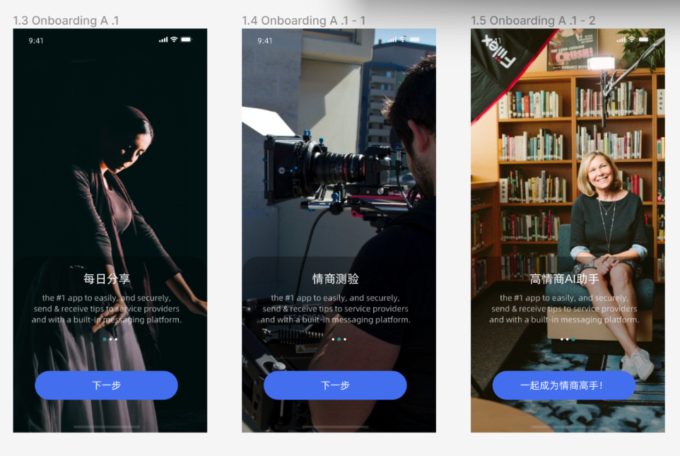<br />2. 具体要求是开始模块的呈现是用户在首次下载并打开软件时才会呈现的，可以参考一下其他的现成代码。具体的内容和配图可以自己去写和找，内容主题是和上面一样的三页。 | 司晗熠 |          |
| 登录、注册模块开发   | 1. 实现基本的登陆注册功能，各种弹窗显示也要做好<br />2. 实现用户登录状态的控制：保持、更新、终止<br />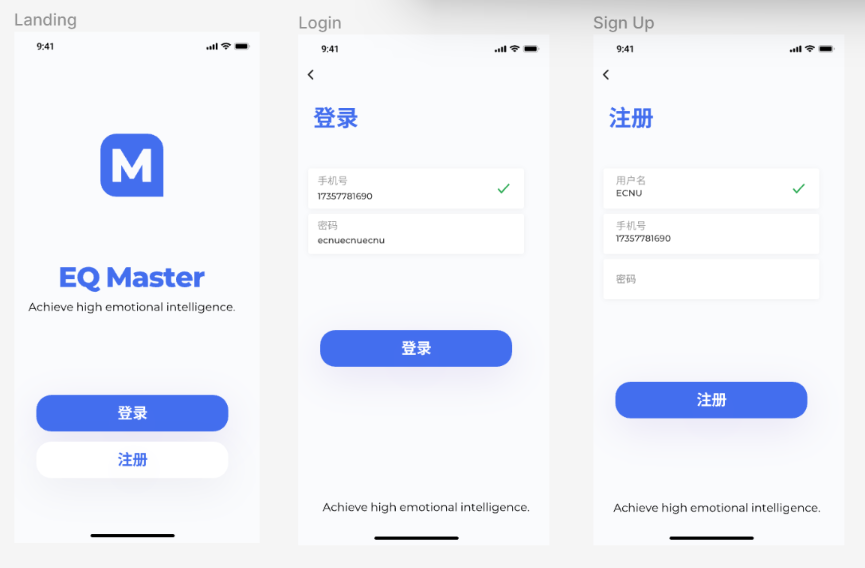 | 叶晓良 |          |
| 每日分享模块开发     | 1. 实现基本的页面展示，包括“首页”、“详情页”、“评论页”......<br />2. 实现各种动态特效和组件的开发，包括“首页滑窗”、“点击效果”、“组件滑动效果”、“页面切换效果”、“数据更新”、“评论弹窗”、“点赞效果”......<br />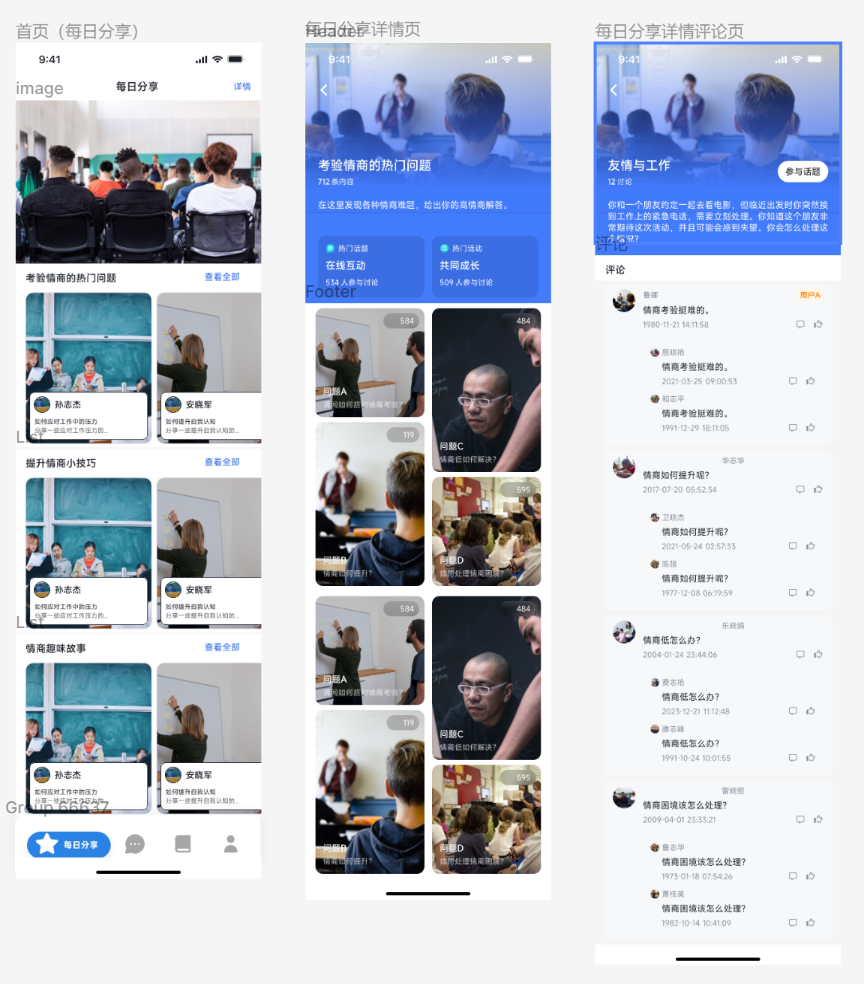 | 叶晓良 |          |
| AI模型训练           | 1. 对应整理好的数据利用Python的语言特性进行数据处理，利用智谱AI模型进行LoRA微调<br />2. 把微调后的模型接入项目中 | 叶晓良 |          |
| AI高情商回复模块开发 | 1. 实现聊天记录的懒加载查询<br />2. 实现对话效果，包括用户信息弹窗、AI回答的流输出效果<br />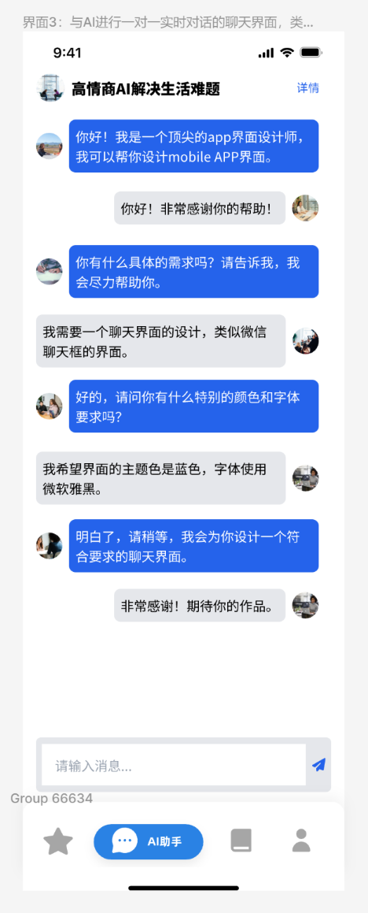 | 叶晓良 |          |
| 情商测验模块开发     | 1. 界面的基本展示，包括首页展示、详情展示、考题展示、考题答案页展示......<br />2. 实现用户做题的具体过程，包括“题目切换”、“倒计时”、“答案展示”、“答题效果”......<br />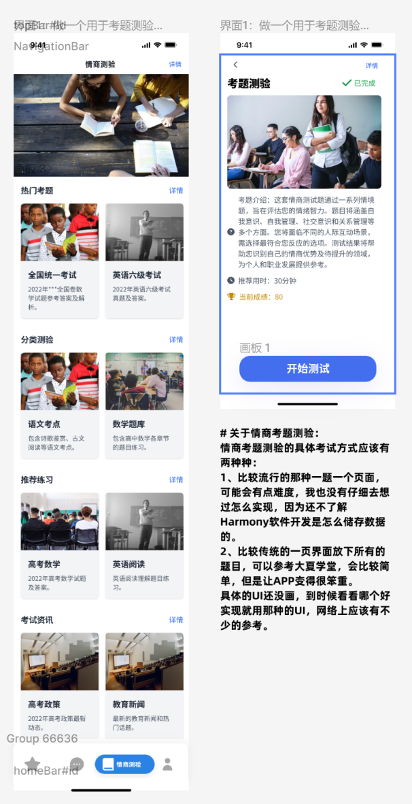 | 叶晓良 |          |
| 个人主页模块开发     | 1. 个人界面各种信息显示<br />2. “情商提升曲线”和“测评分数曲线”展示，具体的“情商提升曲线”中的数据算法还没确定，先把静态页面写好就行，后面一起讨论<br />3. 修改个人信息界面制作<br />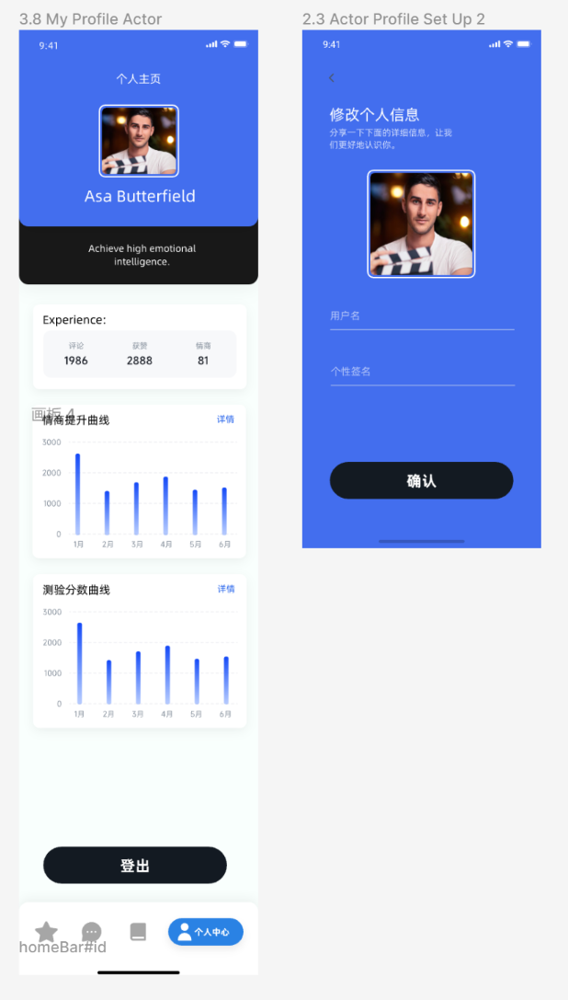 | 王宇飞 |          |
| Java后端开发         | 包括数据库管理、接口提供、AI接口接入、用户状态维护等等       | 叶晓良 |          |

注：

1. 负责的模块中有涉及页面设计的，比如配图和介绍性文本，尽量发到群里让大家看看，保持风格统一。
2. 我负责的部分就没怎么详细写“任务具体介绍了”，其他的任务都已经详细写了介绍说明，有不同的部分随时来群里或者私聊问我。
3. 对应部分可以看看本文件的“资源参考”部分，我整理了很多可以参考的对应项目代码。
4. 项目开发进行过程中有任何问题都可以随时讨论，有疑问或者歧义的地方尽早询问，避免无用功，有很好的设计和改进意见也欢迎提出。
5. 具体的项目代码结构在上面已经列出，但是并不完备，在对应的部分编写自己的代码，需要建立其他的文件夹也都ok，有通用的组件可以放置在components文件夹中。
6. 具体的开发过程需要大家fork一份仓库代码，然后建立自己的branch分支，阶段性的pr就行。

---

## 接口文档

---

## 数据库设计

---

## 资源参考

### 学习资源

- 知识地图（基于开发者任务旅程的知识地图，聚合开发指南、Codelabs、示例代码、API参考、常见问题、视频教程等官方套件，帮助开发者一站式便捷获取信息）：[知识地图-HarmonyOS应用开发知识-华为开发者联盟](https://developer.huawei.com/consumer/cn/app/knowledge-map/)

### 设计资源

- 设计资源（不断更新的设计资源库，包含图标、色彩、文字、音效等丰富的资源，并且提供多种效率组件和界面模版，帮助快速准确地设计 HarmonyOS 应用）：[设计资源-HarmonyOS设计-开发者联盟](https://developer.huawei.com/consumer/cn/design/resource/)

### 库资源

- OpenHarmony三方库中心仓：[OpenHarmony三方库中心仓](https://ohpm.openharmony.cn/#/cn/home)
- 开源三方库资源汇总：[tpc_resource: 三方组件资源汇总](https://gitee.com/openharmony-tpc/tpc_resource?_from=gitee_search)

### 项目资源

#### 完整项目示例

- 官方示例代码：[HarmonyOS示例代码-鸿蒙系统示例代码-华为开发者联盟](https://developer.huawei.com/consumer/cn/samples/)
- [溪村小镇-HarmonyOS NEXT-Codelabs-华为开发者联盟](https://developer.huawei.com/consumer/cn/codelabsPortal/carddetails/tutorials_NEXT-OxHornCampus)
- [一次开发，多端部署-购物应用-HarmonyOS NEXT-Codelabs-华为开发者联盟](https://developer.huawei.com/consumer/cn/codelabsPortal/carddetails/tutorials_Next-MultiShopping)

#### 通用模块

##### 界面设计

- [常用组件与布局-HarmonyOS NEXT-Codelabs-华为开发者联盟](https://developer.huawei.com/consumer/cn/codelabsPortal/carddetails/tutorials_NEXT-ArkTSComponents)
- [目标管理-HarmonyOS NEXT-Codelabs-华为开发者联盟](https://developer.huawei.com/consumer/cn/codelabsPortal/carddetails/tutorials_NEXT-TargetManagement)
- [ArkUI常用布局容器对齐方式-HarmonyOS NEXT-Codelabs-华为开发者联盟](https://developer.huawei.com/consumer/cn/codelabsPortal/carddetails/tutorials_NEXT-LayoutAlign)
- [弹性布局-HarmonyOS NEXT-Codelabs-华为开发者联盟](https://developer.huawei.com/consumer/cn/codelabsPortal/carddetails/tutorials_NEXT-FlexLayout)
- [HarmonyOS_Samples/GenerateSandboxFile](https://gitee.com/harmonyos_samples/GenerateSandboxFile)
- [Immersive: 本示例介绍设置窗口全屏和扩展组件安全区域两种实现沉浸式效果的方式，并对状态栏、导航栏、挖空区域根据不同场景进行适配，为用户提供更优的视觉体验。](https://gitee.com/harmonyos_samples/Immersive)
- [DataCache: 本示例是基于ArkTS的声明式开发范式实现的样例，主要介绍了首页数据缓存来加速应用冷启动的使用。](https://gitee.com/harmonyos_samples/DataCache)
- [HarmonyOS_Samples/SystemEnvVarSubscriber](https://gitee.com/harmonyos_samples/SystemEnvVarSubscriber)
- [ComponentStack: 本示例介绍运用Stack组件以构建多层次堆叠的视觉效果。通过绑定Scroll组件的onScrollFrameBegin滚动事件回调函数，精准捕获滚动动作的发生。当滚动时，实时地调节组件的透明度、高度等属性，从而成功实现了嵌套滚动效果、透明度动态变化以及平滑的组件切换。](https://gitee.com/harmonyos_samples/component-stack)
- [ScrollComponentNestedSliding: 该示例通过nestedScroll属性，实现了上滑Scroll容器，滑至Tabs子组件处，Tabs吸顶，List子组件中内容可继续滑动的功能。](https://gitee.com/harmonyos_samples/scroll-component-nested-sliding)
- [NestedList: 本示例通过List组件scrollToIndex方法实现List组件嵌套滑动。](https://gitee.com/harmonyos_samples/nested-list)

##### 界面转换

- [合理使用页面间转场-开发高性能ArkUI-UI框架-应用框架开发-功能开发-最佳实践 - 华为HarmonyOS开发者](https://developer.huawei.com/consumer/cn/doc/best-practices-V5/bpta-page-transition-V5)
- [基于HMRouter路由框架的页面跳转开发实践-UI框架-应用框架开发-功能开发-最佳实践 - 华为HarmonyOS开发者](https://developer.huawei.com/consumer/cn/doc/best-practices-V5/bpta-hmrouter-V5#section66821381824)
- [转场动画的使用-HarmonyOS NEXT-Codelabs-华为开发者联盟](https://developer.huawei.com/consumer/cn/codelabsPortal/carddetails/tutorials_Next-TransitionAnimation)
- [PageSlip: 本项目是一个基于ArkTS的应用程序，基于伙伴高频使用场景，构建复杂的流畅滑动页面，滑动时不丢帧。](https://gitee.com/harmonyos_samples/PageSlip)
- [TransitionsCollection: 本示例基于基础组件、通用属性、显式动效，实现多种常见转场动效案例。](https://gitee.com/harmonyos_samples/transitions-collection)

##### 通用组件

- [MultiTabNavigation: 本示例为开发者提供常见的Tab导航的UI样式，包括底部导航，顶部导航，侧边导航等典型场景。](https://gitee.com/harmonyos_samples/multi-tab-navigation)
- [构建多种样式弹窗-HarmonyOS NEXT-Codelabs-华为开发者联盟](https://developer.huawei.com/consumer/cn/codelabsPortal/carddetails/tutorials_Next-MultipleDialog)
- [自定义弹窗开发实践-UI框架-应用框架开发-功能开发-最佳实践 - 华为HarmonyOS开发者](https://developer.huawei.com/consumer/cn/doc/best-practices-V5/bpta-custome-dialog-development-practice-V5)
- [常见导航样式案例开发实践-UI框架-应用框架开发-功能开发-最佳实践 - 华为HarmonyOS开发者](https://developer.huawei.com/consumer/cn/doc/best-practices-V5/bpta-multi-tab-practice-V5)
- [软键盘布局适配解决方案-输入法框架-应用框架开发-功能开发-最佳实践 - 华为HarmonyOS开发者](https://developer.huawei.com/consumer/cn/doc/best-practices-V5/bpta-keyboard-layout-adapt-V5)
- [自定义下拉刷新动画-HarmonyOS NEXT-Codelabs-华为开发者联盟](https://developer.huawei.com/consumer/cn/codelabsPortal/carddetails/tutorials_NEXT-AnimateRefresh)
- [ScenarioFusionKit_SampleCode_FunctionalBtn_ArkTS: 本示例展示了使用华为融合场景服务提供的场景化Button。](https://gitee.com/harmonyos_samples/scenario-fusion-kit_-sample-code_-functional-btn_-arkts)
- [DynamicComponent: 本示例介绍了在声明式UI中实现组件动态创建的方法.](https://gitee.com/harmonyos_samples/DynamicComponent)
- [TextEffects: 本示例基于Text组件及通用属性实现多种文字特效。](https://gitee.com/harmonyos_samples/text-effects)
- [AnimationCollection: 本示例基于基础组件、通用属性、显式动效，实现多种常见动效案例。](https://gitee.com/harmonyos_samples/animation-collection)
- [HarmonyOS_Samples/ComponentEncapsulation](https://gitee.com/harmonyos_samples/ComponentEncapsulation)
- [ComponentCollection: 本示例为ArkUI中组件、通用、动画、全局方法的集合。](https://gitee.com/harmonyos_samples/component-collection)

##### 数据存储

- [本地数据与文件调试-本地数据与文件-功能开发-最佳实践 - 华为HarmonyOS开发者](https://developer.huawei.com/consumer/cn/doc/best-practices-V5/bpta-local-file-and-data-debugging-V5)
- [首选项-HarmonyOS NEXT-Codelabs-华为开发者联盟](https://developer.huawei.com/consumer/cn/codelabsPortal/carddetails/tutorials_NEXT-Preferences)
- [分布式通讯录-HarmonyOS NEXT-Codelabs-华为开发者联盟](https://developer.huawei.com/consumer/cn/codelabsPortal/carddetails/tutorials_NEXT-DistributedContacts)
- [关系型数据库-HarmonyOS NEXT-Codelabs-华为开发者联盟](https://developer.huawei.com/consumer/cn/codelabsPortal/carddetails/tutorials_NEXT-Rdb)
- [HarmonyOS_Samples/KVStore](https://gitee.com/harmonyos_samples/KVStore)

##### 网络传输

- [Web组件之cookie常见操作-HarmonyOS NEXT-Codelabs-华为开发者联盟](https://developer.huawei.com/consumer/cn/codelabsPortal/carddetails/tutorials_NEXT-WebCookie)
- [ArkTS与H5的交互-HarmonyOS NEXT-Codelabs-华为开发者联盟](https://developer.huawei.com/consumer/cn/codelabsPortal/carddetails/tutorials_NEXT-SelectContact)
- [HTTPS请求过程-HarmonyOS NEXT-Codelabs-华为开发者联盟](https://developer.huawei.com/consumer/cn/codelabsPortal/carddetails/tutorials_NEXT-HttpsRequest)
- [Http: 本示例通过@ohos.net.http等接口，实现了根据URL地址和相关配置项发起http请求的功能。](https://gitee.com/harmonyos_samples/http)
- [PageRedirection: 本示例基于ArkUI框架和Web实现了H5页面和ArkTS原生界面之间的相互跳转。](https://gitee.com/harmonyos_samples/page-redirection)

#### 适用功能模块

##### 开始模块

- [应用首次启动-HarmonyOS NEXT-Codelabs-华为开发者联盟](https://developer.huawei.com/consumer/cn/codelabsPortal/carddetails/tutorials_NEXT-FirstStartDemo_HOS)
- [窗口管理-HarmonyOS NEXT-Codelabs-华为开发者联盟](https://developer.huawei.com/consumer/cn/codelabsPortal/carddetails/tutorials_NEXT-WindowManager)
- [UserAuth: 本示例主要使用人脸和指纹认证用户身份、使用密码保险箱实现密码自动填充以及涉及口令输入的应用界面防截屏或录屏等功能的实现方式。](https://gitee.com/harmonyos_samples/UserAuth)
- [VerificationCodeScenario: 本示例介绍了文本框显示光标、底部加横条、背景颜色改变、选择验证码、滑块验证码五种验证码实例。](https://gitee.com/harmonyos_samples/verification-code-scenario)

##### 每日分享

- [一多开发实例（社区评论）-一次开发，多端部署-HarmonyOS特征-最佳实践 - 华为HarmonyOS开发者](https://developer.huawei.com/consumer/cn/doc/best-practices-V5/multi-community-app-V5)
- [一多开发实例（新闻阅读）-一次开发，多端部署-HarmonyOS特征-最佳实践 - 华为HarmonyOS开发者](https://developer.huawei.com/consumer/cn/doc/best-practices-V5/multi-news-read-V5)
- [体验流畅的首页信息流-新闻阅读类-行业场景-业务场景与解决方案-最佳实践 - 华为HarmonyOS开发者](https://developer.huawei.com/consumer/cn/doc/best-practices-V5/bpta-news_homepage-V5#section1812017554315)
- [评论回复弹窗开发实践-UI框架-应用框架开发-功能开发-最佳实践 - 华为HarmonyOS开发者](https://developer.huawei.com/consumer/cn/doc/best-practices-V5/bpta-comment-reply-pop-up-window-V5)
- [新闻发布-HarmonyOS NEXT-Codelabs-华为开发者联盟](https://developer.huawei.com/consumer/cn/codelabsPortal/carddetails/tutorials_NEXT-NewsRelease)
- [一次开发，多端部署-社区评论-HarmonyOS NEXT-Codelabs-华为开发者联盟](https://developer.huawei.com/consumer/cn/codelabsPortal/carddetails/tutorials_NEXT-MultiCommunityApplication)
- [新闻数据加载-HarmonyOS NEXT-Codelabs-华为开发者联盟](https://developer.huawei.com/consumer/cn/codelabsPortal/carddetails/tutorials_NEXT-NewsDataArkTS)
- [Swiper的使用-HarmonyOS NEXT-Codelabs-华为开发者联盟](https://developer.huawei.com/consumer/cn/codelabsPortal/carddetails/tutorials_Next-SwiperArkTS)
- [ImageComment: 本示例通过拉起系统相机实现发布图片评论。](https://gitee.com/harmonyos_samples/image-comment)

##### AI高情商回复

- [一多开发实例（即时通讯）-一次开发，多端部署-HarmonyOS特征-最佳实践 - 华为HarmonyOS开发者](https://developer.huawei.com/consumer/cn/doc/best-practices-V5/multi-communication-app-V5)

##### 情商测验

- [FormGame: 本示例展示了如何通过Stage模型实现一个简单的游戏卡片。](https://gitee.com/harmonyos_samples/form-game)

##### 个人界面

- [一多开发实例（股票类）-一次开发，多端部署-HarmonyOS特征-最佳实践 - 华为HarmonyOS开发者](https://developer.huawei.com/consumer/cn/doc/best-practices-V5/multi-ticket-class-V5)
- [LoginAndLogout: 本示例是基于Navigation实现导航跳转，采用PromptAction实现弹窗。模拟登录和注销的场景实现，且界面满足一多适配。](https://gitee.com/harmonyos_samples/login-and-logout)

#### 拓展模块

- [桌面快捷方式开发实践-程序包结构-应用框架开发-功能开发-最佳实践 - 华为HarmonyOS开发者](https://developer.huawei.com/consumer/cn/doc/best-practices-V5/bpta-desktop-shortcuts-V5)
- [卡片更新与数据交互-服务卡片-应用框架开发-功能开发-最佳实践 - 华为HarmonyOS开发者](https://developer.huawei.com/consumer/cn/doc/best-practices-V5/bpta-card-update-and-data-interaction-V5)
- [HarmonyOS_Samples/MusicCard](https://gitee.com/harmonyos_samples/MusicCard)
- [CardInfoRefresh: 本示例实现使用router、call和message三种事件，以及定点刷新的方式实现卡片信息的刷新。](https://gitee.com/harmonyos_samples/CardInfoRefresh)

#### 知识性模块

- [UIAbility和自定义组件生命周期-HarmonyOS NEXT-Codelabs-华为开发者联盟](https://developer.huawei.com/consumer/cn/codelabsPortal/carddetails/tutorials_NEXT-UIAbilityLifeCycle)
- [库的调用-HarmonyOS NEXT-Codelabs-华为开发者联盟](https://developer.huawei.com/consumer/cn/codelabsPortal/carddetails/tutorials_NEXT-ThirdPartyLibrary)
- [HarmonyOS_Samples/PermissionApplication](https://gitee.com/harmonyos_samples/PermissionApplication)
- [Observer: 本示例通过@ohos.telephony.observer等接口订阅网络状态、信号状态、蜂窝数据、sim状态等事件，并获取状态变化返回的结果。](https://gitee.com/harmonyos_samples/observer)
- [CustomCommonEvent: 本示例主要展示了公共事件相关的功能，实现了一个检测用户部分行为的应用。](https://gitee.com/harmonyos_samples/custom-common-event)

---

## 可扩展模块

### 应用市场上架

> [Store Kit（应用市场服务）-应用服务 - 华为HarmonyOS开发者](https://developer.huawei.com/consumer/cn/doc/harmonyos-guides-V5/store-kit-guide-V5)

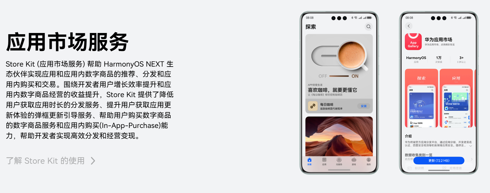

### 商业变现

> [IAP Kit（应用内支付服务）-应用服务 - 华为HarmonyOS开发者](https://developer.huawei.com/consumer/cn/doc/harmonyos-guides-V5/iap-kit-guide-V5)

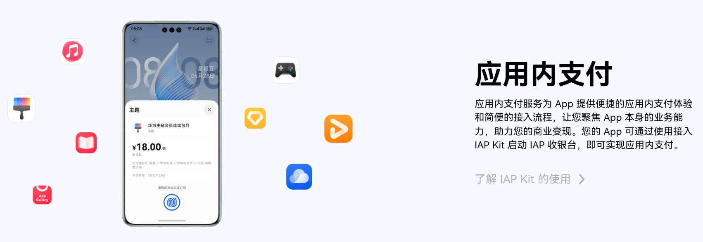

### 卡片服务（针对每日推荐模块）

> [Form Kit简介-Form Kit（卡片开发服务）-应用框架 - 华为HarmonyOS开发者](https://developer.huawei.com/consumer/cn/doc/harmonyos-guides-V5/formkit-overview-V5)

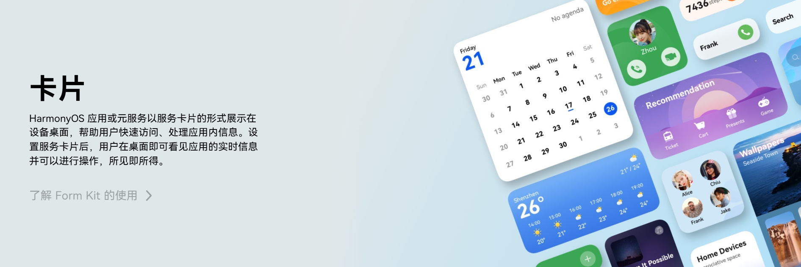

### 实况窗（针对情商测试模块）

> [文档中心](https://developer.huawei.com/consumer/cn/doc/harmonyos-guides-V5/liveview-introduction-V5)

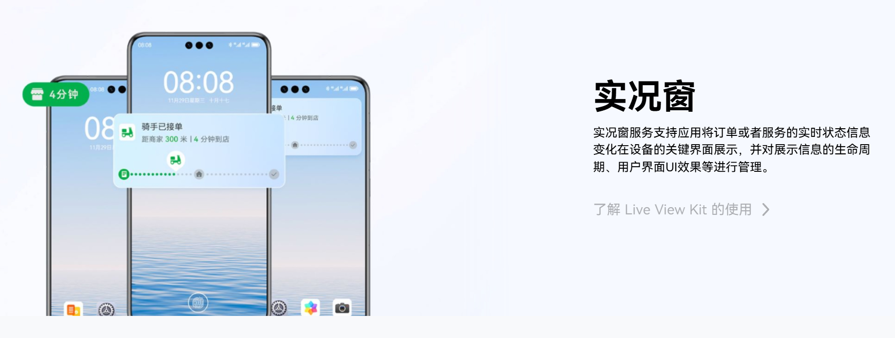

### 个性化设计

### 情商分析模块

### <u>***考完之后讨论（先让大家网上或者自己找idea和资源，要求性讨论，写研究报告（各个模块：完备、新意、AI联合、发挥HarmonyOS NEXT 特性、商业化））***</u>

### 约饭

### 宽心数字喵——基于NLP的情绪调节器

### <u>***发挥HarmonyOS NEXT 特性【最大卖点、双创创新和华为比赛加分要求】（比赛官网）*</u>

### AI增强训练

- **Product Hunt** 【[Product Hunt – The best new products in tech.](https://www.producthunt.com/)】是一个为科技产品爱好者和创业者提供的平台，用于发现、分享和讨论最新的科技产品。
- **神器集**【[AI网址导航 | AI产品及智能工具网站推荐排行榜 - AI神器集](https://hao.logosc.cn/)】是一个发现和分享有趣在线工具的网站，每天推荐简单实用的互联网工具，帮助用户发现和分享有趣、实用的在线工具。
- **2024 年 Apple 设计大奖**【[Apple 宣布 2024 年 Apple 设计大奖获奖者 - Apple (中国大陆)](https://www.apple.com.cn/newsroom/2024/06/apple-announces-winners-of-the-2024-apple-design-awards/)】是苹果公司为表彰和奖励在设计、创新和技术应用上表现卓越的应用程序和游戏而设立的一项年度奖项。这一奖项不仅体现了苹果对高质量设计的重视，也展示了开发者如何充分利用 Apple 的生态系统，为用户带来优秀的体验。

### 心理学专业援助：AI训练数据质量、AI功能合理、每日分享词条质量、每日分享模块质量、测验题目模块质量、测验题目质量、测验评分标准质量、情商计算、情商维度、情商和测验展示模块、<u>*重点在目标用户需求*</u>（自由发挥、讨论）

### 指导老师援助：陈良育（自由发挥、讨论）

---

## 赛事相关

- 官网（开发赛、专栏）
- 咨询相关人员
- 双创赛（陈良育提意见、ai赋能、国产操作系统、有市场、完备、ai加强、有时间一直往下做）
- 软件赛
- [HarmonyOS创新赛](https://developer.huawei.com/consumer/cn/activity/digixActivity/digixcmsdetail/201704877290631804)
- <u>***完备***</u>
- ai加强
- <u>***有时间一直往下做***</u>